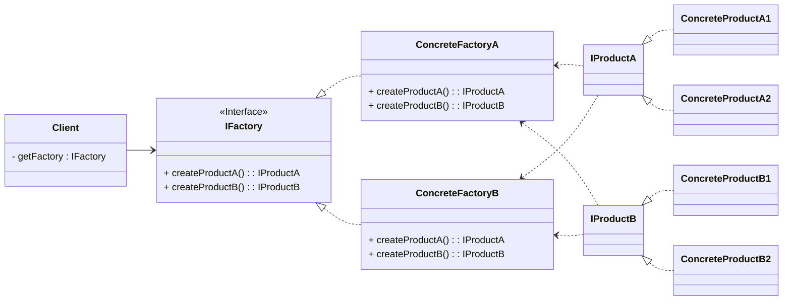
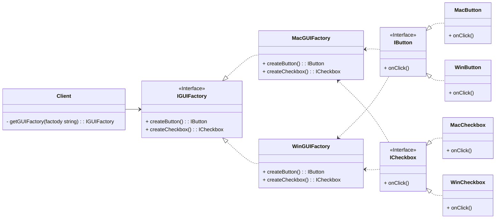

Abstract Factory Method memungkinkan Anda untuk membuat objek-objek yang saling terkait dan bergantung satu sama lain tanpa perlu mengungkapkan detail konkretnya. Ini menciptakan antarmuka abstrak (interface atau kelas abstrak) yang mendefinisikan serangkaian metode untuk membuat objek-objek yang terkait. Kemudian, Anda dapat membuat implementasi konkret dari antarmuka ini untuk menghasilkan kelompok objek yang berbeda sesuai dengan kebutuhan.

Diagram konsep:

Diagram implementasi:

## Kapan?

 - Ketika kode Anda perlu bekerja dengan berbagai kelompok produk terkait, namun Anda tidak ingin kode tersebut bergantung pada kelas konkret dari produk tersebut—mereka mungkin tidak diketahui sebelumnya atau Anda hanya ingin memungkinkan perluasan di masa mendatang.
 - Anda memiliki sebuah kelas yang harus melakukan satu pekerjaan utama (tanggung jawab utama), tetapi juga melakukan pekerjaan lain yang tidak seharusnya menjadi tanggung jawabnya.

## Referensi
- https://refactoring.guru/design-patterns/abstract-factory
- https://golangbyexample.com/abstract-factory-design-pattern-go/
