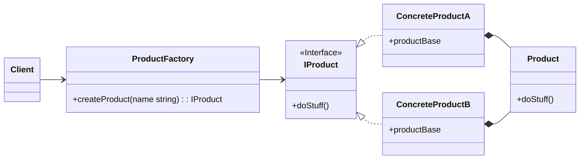
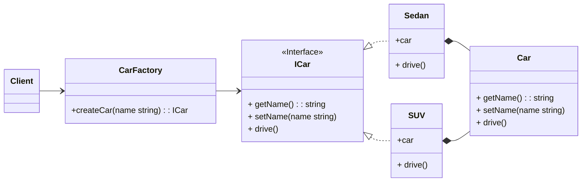

Factory design menyediakan cara untuk menyembunyikan logika pembuatan instance yang dibuat. Klien hanya berinteraksi dengan struct factory dan memberitahukan jenis instance yang perlu dibuat. Kelas factory berinteraksi dengan struct konkrit yang sesuai dan mengembalikan instance yang benar.

Diagram konsep:

1. `IProduct` adalah interface yang akan diimplementasikan pada struct `Product`.
2. `Product` adalah struct yang mengimplementasikan interface `IProduct`.
3. `ProductFactory` adalah struct yang memiliki method yang mengembalikan struct `Product` yang telah mengimplementasi interface `IProduct`.
4. Struct `ProductBase` akan disematkan ke produk yang lebih spesifik.

Mapping:
|UML|Code|
|--|--|
|Client|main()|
|ProductFactory|CarFactory|
|IProduct|ICar|
|Product|Car|
|ConcreteProduct1|Sedan|
|ConcreteProduct2|SUV|

Diagram implementasi:

## Referensi
- https://refactoring.guru/design-patterns/factory-method
- https://golangbyexample.com/golang-factory-design-pattern/
